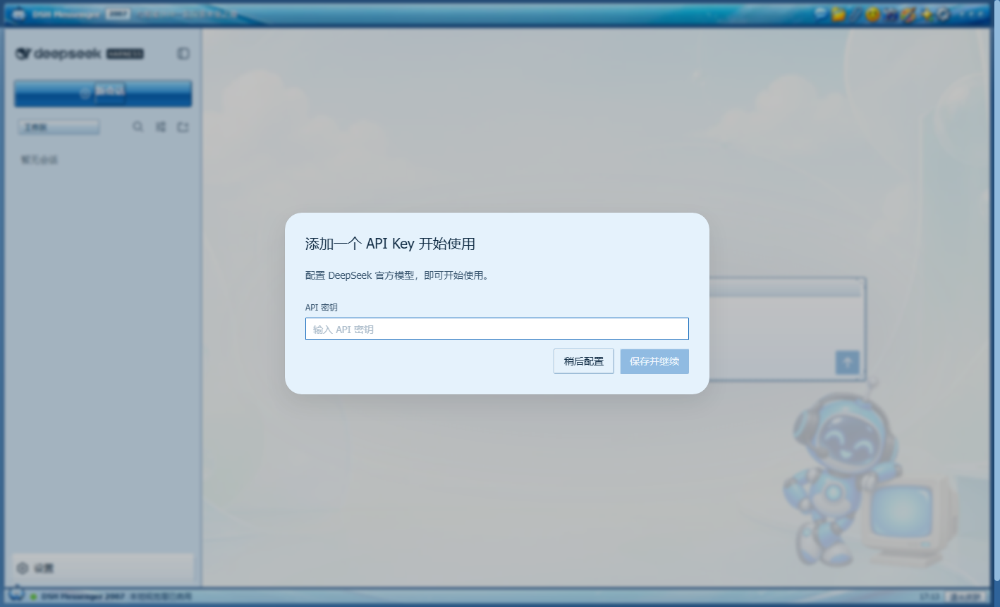

<p align="center">
  
</p>

<div align="center">

# dsh-qq2007-skin

**Turn the DSH Web GUI into a blue 2007-era messenger window while preserving every native interaction.**

[中文](README.md) · [Architecture](docs/ARCHITECTURE.md) · [Art direction](assets/ART_DIRECTION.md) · [Compatibility](docs/COMPATIBILITY.md)

[](https://awesome.re) [](https://awesome-dsh-plugin.com) [](https://github.com/LeemanCheung/dsh-qq2007-skin/actions/workflows/ci.yml)


</div>

> [!IMPORTANT]
> This is an independent, unofficial nostalgia project. It is not affiliated with, authorized by, or endorsed by Tencent, QQ, or DeepSeek. It ships no QQ logos, mascot art, historical icons, historical sounds, or theme files. Its robot, chrome, toolbar, wallpaper, and optional synthesized chime are original project assets. See [NOTICE](NOTICE.md).

## Features

- Genuine 2007 desktop-client texture: persistent blue application strip, XP highlight bands and 1px bevels, full-width contact groups, flatter transcript rows, rectangular composer, recessed scrollbars, and a bottom status bar.
- Account-card treatment around the native DSH logo row: original robot avatar and factual “Local user · skin enabled” copy without replacing its session or collapse actions.
- Denser contact rows and transcript hierarchy: native status/time metadata stays visible, with compact user headings, separators, and assistant-side rules instead of modern oversized bubbles.
- Classic text-send chrome: preserves the native submit element, handler, disabled state, and accessible name while drawing a glossy 2007-style rectangle—without implying a nonexistent dropdown.
- Optional original two-note action chime, off by default with one preview when enabled. It then synthesizes roughly 0.18 seconds after a native send click or when Enter moves the draft into submission. It is not delivery-success feedback and includes no historical recording or audio file.
- Four original native Codex `gpt-image-2` assets: robot/CRT buddy, blue-glass chrome, eight generic retro toolbar icons, and room/sky wallpaper. Prompts and call provenance are committed; runtime use is fully offline.
- Native three-pane mapping: DSH sidebar / conversation / details become contacts / messages / buddy details without duplicating business data.
- 72 native `--dsw-*` tokens registered through the official `ctx.theme.register()` API.
- Native sessions, model picker, attachments, send controls, tool cards, settings, and details behavior remain untouched.
- Enabled on first install, with independent reversible **Settings → General** appearance and sound switches; opted-in sound can remain active under system appearance.
- The status strip reports only the local visual layer, optional sound state, and browser clock; it invents no model, quota, connection, or agent state.
- Responsive layout plus reduced-motion and forced-colors fallbacks.
- Stores only browser-local appearance/sound flags and the previous built-in theme preference; copies, retains, and transmits no prompts, replies, sessions, files, or credentials. Sound only checks whether the native composer changed from non-empty to empty around Enter.

## Compatibility and recovery

- The baseline is DSH `0.1.0-rc.6`, Node.js 20+, and a modern Chromium, Firefox, or WebKit browser with CSS custom properties. The optional chime also needs Web Audio; an unsupported or policy-blocked browser remains silent without affecting chat.
- `dsh.bundle`, theme tokens, `theme/change`, and the General Settings Slot are stable extension points. CSS-module suffix selectors, plus the full chrome's `:has()` and WebKit scrollbar styling, are best-effort: a DSH Shell redesign may reduce decorative fidelity while native theming and the settings switch keep working.
- Below 1180 px the decorative title icon is hidden; at 800 px and below the extra chrome, margin, composer ornament, and status strip are removed. `prefers-reduced-motion` disables buddy motion and shortens transitions, while `forced-colors` restores system borders.
- There is no YAML configuration. Appearance, sound, and the previous built-in theme live only in this browser's `localStorage`: `dsh-qq2007-skin:enabled`, `dsh-qq2007-skin:sound`, and `dsh-qq2007-skin:previous-theme`. Clearing site data restores first-install defaults (appearance on, sound off); a third-party custom theme cannot be restored byte-for-byte, so recovery returns only the prior built-in `light`, `dark`, or `system` choice.
- The skin's own Settings and status-bar copy is currently Chinese. Click-to-chime recognizes only the native Chinese `发送消息` and English `Send message` accessible labels; in other UI locales an Enter submission can still sound after DSH clears a non-empty draft, but a button click may remain silent.
- Use **Settings → General → QQ 2007 Retro Skin → System appearance** first. If Settings cannot open, remove the plugin and restart `dsh web`; Cordis then removes every theme registration, stylesheet, DOM decoration, listener, timer, and optional AudioContext.

The hero image is a real Chromium capture from an isolated DSH `0.1.0-rc.6` profile. Runtime versions of the four Codex-generated assets:

<table><tr><td width="36%"></td><td><br><br></td></tr></table>

## Install

```sh
dsh plugin --profile web add github:LeemanCheung/dsh-qq2007-skin
dsh web
```

Pin the current release:

```sh
dsh plugin --profile web add github:LeemanCheung/dsh-qq2007-skin#v0.3.0
```

From source:

```sh
git clone https://github.com/LeemanCheung/dsh-qq2007-skin.git
cd dsh-qq2007-skin
npm test
dsh plugin --profile web add ./
```

## Update / remove

```sh
dsh plugin --profile web update dsh-qq2007-skin
dsh plugin --profile web remove dsh-qq2007-skin
```

Restart `dsh web` after changing profile plugins. Stopping or removing the plugin disposes its theme registration, CSS, application/status DOM, timer, send listeners, optional AudioContext, and settings entry.

## How it works

Unlike the CDP-based reference project [Codex-QQ2007-Skin](https://github.com/LeemanCheung/Codex-QQ2007-Skin), this plugin uses DSH's native Cordis browser-plugin, ThemeRuntime, and Settings Slot APIs. The host half is a no-op bundle entry; the browser half registers the palette, installs strictly scoped CSS, embeds four compact offline artworks plus the original SVG, tracks `theme/change`, and exposes reversible appearance and sound settings. The optional send chime uses two short Web Audio oscillators and carries no audio asset.

See [Architecture](docs/ARCHITECTURE.md) and [Compatibility](docs/COMPATIBILITY.md).

## Develop and verify

```sh
npm test
npm run pack:check
```

The deterministic VM gate covers module registration, all 72 tokens, first-run activation, both settings, native-button and submitted-Enter chime triggers, silent Shift+Enter, all four embedded WebP assets, persistence, theme synchronization, listeners, and AudioContext cleanup. Manual real-Chromium release verification covers the account card, 64×27 text-send button, sound toggle, 800/801 px responsive threshold, and appearance disable/re-enable cycle.

Maintainers can rebuild the committed runtime WebP derivatives from the repository-only high-resolution sources with `python scripts/process-art.py` (Pillow 10+). The published package intentionally omits those sources and the helper; normal installation and `npm test` need neither Python nor network access.

## License

Code and original assets are [MIT licensed](LICENSE). Product-name and independence notices are in [NOTICE.md](NOTICE.md).
