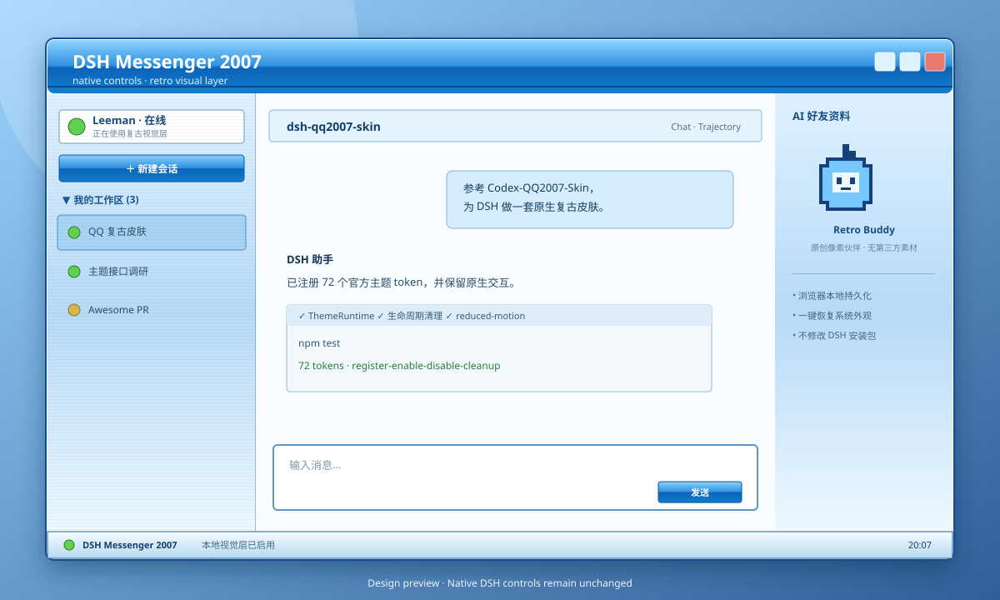

<p align="center">
  
</p>

<div align="center">

# dsh-qq2007-skin

**把 DSH Web GUI 变成 2007 年蓝色即时通讯窗口，同时保留全部原生交互。**

[English](README.en.md) · [架构](docs/ARCHITECTURE.md) · [兼容性](docs/COMPATIBILITY.md)

[](https://github.com/LeemanCheung/dsh-qq2007-skin/actions/workflows/ci.yml)


</div>

> [!IMPORTANT]
> 这是独立、非官方的怀旧视觉项目，与腾讯、QQ、DeepSeek 均无隶属、授权或背书关系。仓库不包含 QQ Logo、企鹅形象、历史图标、音效或主题文件；像素伙伴和预览图均为本项目原创素材。详见 [NOTICE](NOTICE.md)。

## 特性

- **经典蓝色窗口**：高光标题栏、浅蓝联系人侧栏、聊天主窗、资料侧栏和底部状态条。
- **三栏语义映射**：DSH 原生 sidebar / conversation / details 分别呈现为联系人列表、消息窗口和好友资料区，不复制业务数据。
- **72 个原生主题 token**：通过官方 `ctx.theme.register()` 接入，不修改 DSH 安装包，也不开 CDP 调试端口。
- **原生交互保留**：会话、模型、附件、发送、工具卡、设置和详情面板仍由 DSH 自己处理。
- **可切换、可撤销**：首次安装自动启用；在 **设置 → 通用 → QQ 2007 复古皮肤** 一键恢复系统外观。
- **原创像素伙伴**：离线内嵌 SVG，只表达“本地视觉层已启用”和真实本地时钟，不伪造模型、额度或 Agent 状态。
- **可访问与响应式**：支持 `prefers-reduced-motion`、高对比色模式；窄屏自动撤掉窗框边距和状态条。
- **隐私安全**：只在浏览器 `localStorage` 保存 `on|off` 与切换前的系统主题偏好，不读取提示词、回复、会话、文件或凭据。

上图为隔离 DSH `0.1.0-rc.6` profile 的真实浏览器截图；展开完整三栏后的设计方向如下：

<p align="center"></p>

## 安装

```sh
dsh plugin --profile web add github:LeemanCheung/dsh-qq2007-skin
```

重启 Web 服务并刷新页面：

```sh
dsh web
```

首次加载默认启用皮肤。想暂时关闭：打开 **设置 → 通用 → QQ 2007 复古皮肤 → 系统外观**；状态条右侧的“退出皮肤”也可立即切回。

### 固定版本

```sh
dsh plugin --profile web add github:LeemanCheung/dsh-qq2007-skin#v0.1.0
```

### 从源码安装

```sh
git clone https://github.com/LeemanCheung/dsh-qq2007-skin.git
cd dsh-qq2007-skin
npm test
dsh plugin --profile web add ./
```

## 更新与卸载

```sh
# 更新 GitHub 安装
dsh plugin --profile web update dsh-qq2007-skin

# 卸载
dsh plugin --profile web remove dsh-qq2007-skin
```

随后重启 `dsh web`。插件停止或卸载时，Cordis 生命周期会移除主题注册、CSS、状态条、计时器和设置项。

## 工作原理

```text
package.json dsh.bundle
        │
        └─ cordis.patch.yml ── host no-op loader entry
                                      │
package.json dsh.client               ▼
        ├─ ThemeRuntime.register(72 tokens)
        ├─ scoped CSS[data-dsh-qq2007-active]
        ├─ original SVG + factual local clock strip
        └─ settings.general.item toggle
```

与参考项目 [Codex-QQ2007-Skin](https://github.com/LeemanCheung/Codex-QQ2007-Skin) 的 CDP 本机注入不同，本项目直接使用 DSH 官方 Cordis 客户端插件、ThemeRuntime 和设置 Slot。具体生命周期与边界见 [架构文档](docs/ARCHITECTURE.md)。

## 开发与验证

```sh
npm test           # 确定性构建 + VM 生命周期测试
npm run pack:check # 检查发布包内容
```

测试覆盖：客户端模块注册、72 个 token、首次启用、设置开关、状态条按钮、localStorage、主题变化同步、资源内嵌及完整清理。

本地 profile 组合验证：

```sh
dsh plugin --profile web add ./
dsh --profile web --dump-config
```

## 兼容性

当前基线为 DSH `0.1.0-rc.6`。主题 token 和设置 Slot 属于官方扩展点；部分用于强化窗框细节的 CSS module 后缀选择器是 best-effort，DSH 大版本升级后可能需要跟随调整，但不会替换或破坏原生控件。详见 [兼容性说明](docs/COMPATIBILITY.md)。

## 许可

代码与原创素材采用 [MIT License](LICENSE)。商标与独立项目声明见 [NOTICE.md](NOTICE.md)。
